## Architecture Overview

This MATLAB project simulates a lap-time simulation for an FSAE-style vehicle. It uses the **Strategy Pattern** for swappable component models and the **Composite Pattern** for aggregating aerodynamic elements.

### Design Patterns

| Pattern | Where | Purpose |
|---------|-------|---------|
| **Strategy** | `VehicleManager` accepts abstract component interfaces | Swap aero, suspension, powertrain, tire, or track models without changing simulation logic |
| **Composite** | `AeroManager` extends `AeroComponent` and aggregates multiple `AeroComponent` objects | Treat a single aero element or a collection uniformly |

---

## UML Class Diagram

> **Maintainer note:** The diagram below is generated from [`class_diagram.mmd`](class_diagram.mmd). Edit that file, then run `node docs/sync_diagram.js` to regenerate the SVG.

---

## Relationship Summary

### Inheritance (`extends`)

| Abstract Base | Concrete Implementation |
|--------------|------------------------|
| `components.AeroComponent` | `AeroManager`, `FrontWing`, `RearWing`, `UnderbodyFloor`, `SimpleAero` |
| `components.SuspensionComponent` | `SimpleSuspension` |
| `components.PowertrainComponent` | `SimplePowertrain` |
| `components.TireModel` | `SimpleTire` |
| `components.Track` | `TestTrack` |

### Composition (`owns`)

| Owner | Property | Type | Cardinality |
|-------|----------|------|-------------|
| `VehicleManager` | `aero` | `AeroComponent` | 1 |
| `VehicleManager` | `suspension` | `SuspensionComponent` | 1 |
| `VehicleManager` | `powertrain` | `PowertrainComponent` | 1 |
| `VehicleManager` | `tire` | `TireModel` | 1 |
| `VehicleManager` | `track` | `Track` | 1 |
| `VehicleManager` | `state` | `VehicleState` | 1 |

### Aggregation (`manages`)

| Owner | Property | Type | Cardinality |
|-------|----------|------|-------------|
| `AeroManager` | `components` | `AeroComponent` | 0..* |

### Data Flow

`VehicleManager.simulate()` orchestrates the simulation loop:

1. **Track** → curvature, friction, heading at current position
2. **Driver Model** → throttle/brake decision based on look-ahead
3. **AeroComponent** → downforce, drag (uses `VehicleState` for pitch/ride height)
4. **SuspensionComponent** → load transfer, weight distribution
5. **PowertrainComponent** → drive force from speed & throttle
6. **TireModel** → peak friction from normal load
7. **VehicleState** → integrate dynamics forward one timestep