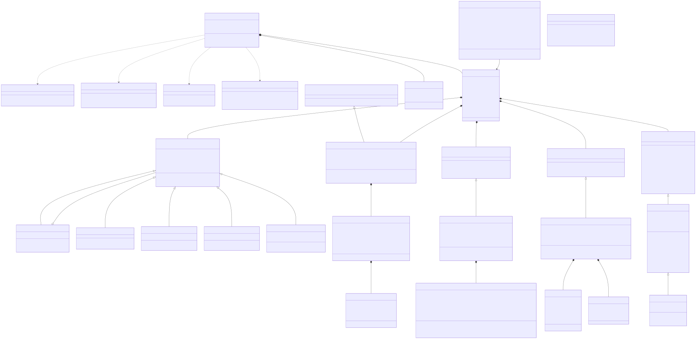

## Architecture Overview

The simulation separates vehicle configuration from simulation execution:

- `lts.vehicle.VehicleManager` stores component references and vehicle-level constants.
- `lts.simulation.Simulator` runs each timestep, asks `lts.driver.DriverModel` for inputs, computes forces, updates subsystem state, integrates `lts.simulation.VehicleState`, and logs telemetry.
- Focused helpers in `lts.simulation` own brake force policy, driveline support, telemetry lap windows, and track-reference preparation so the timestep loop stays readable.
- Component classes live under the MATLAB `lts.components` package and can be swapped when they satisfy the relevant interface.

## Design Patterns

| Pattern | Where | Purpose |
|---------|-------|---------|
| Strategy | `lts.vehicle.VehicleManager` accepts powertrain, tire, aero, suspension, and track component objects | Swap subsystem models without changing the simulation loop |
| Strategy | `WholeCarAero` implements `AeroComponent` | Resolve whole-car aero without changing the simulation loop |
| State object | `lts.simulation.VehicleState`, `SuspensionState`, `TireState`, `PowertrainState` | Persist transient quantities across timesteps |

---

## UML Class Diagram

> Maintainer note: The diagram below is generated from [`class_diagram.mmd`](class_diagram.mmd). Edit that file, then run `node docs/sync_diagram.js` to regenerate the SVG.

---

## Relationship Summary

### Inheritance

| Abstract Base | Concrete Implementations |
|---------------|--------------------------|
| `lts.components.Aero.AeroComponent` | `WholeCarAero`, `AeroManager`, `FrontWing`, `RearWing`, `UnderbodyFloor` |
| `lts.components.Suspension.SuspensionComponent` | `SuspensionManager` |
| `lts.components.Powertrain.PowertrainComponent` | `EMRAX228Powertrain` |
| `lts.components.Chassis.ChassisComponent` | `SimpleChassis` |
| `lts.components.Tire.TireModel` | `PacejkaTire` |
| `lts.components.Track` | `WaypointTrack`; `TestTrack` (extends `WaypointTrack`) |

### Composition

| Owner | Property | Type |
|-------|----------|------|
| `lts.simulation.Simulator` | `vehicleManager` | `lts.vehicle.VehicleManager` |
| `lts.simulation.Simulator` | `driverModel` | `lts.driver.DriverModel` |
| `lts.vehicle.VehicleManager` | `aero` | `lts.components.Aero.AeroComponent` (`WholeCarAero` by default) |
| `lts.vehicle.VehicleManager` | `chassis` | `lts.components.Chassis.SimpleChassis` |
| `lts.vehicle.VehicleManager` | `suspension` | `lts.components.Suspension.SuspensionManager` |
| `lts.vehicle.VehicleManager` | `powertrain` | `lts.components.Powertrain.PowertrainComponent` |
| `lts.vehicle.VehicleManager` | `tire` | `lts.components.Tire.TireModel` |
| `lts.vehicle.VehicleManager` | `track` | `lts.components.Track` |
| `lts.components.Suspension.SuspensionManager` | corner suspensions | `lts.components.Suspension.SimpleSuspension` |
| `lts.components.Suspension.SimpleSuspension` | `state` | `lts.components.Suspension.SuspensionState` |
| `lts.components.Tire.PacejkaTire` | corner states | `lts.components.Tire.TireState` |
| `lts.components.Powertrain.EMRAX228Powertrain` | `state` | `lts.components.Powertrain.PowertrainState` |

### Data Flow

`lts.simulation.Simulator.simulate()` orchestrates the loop:

1. Read current `lts.simulation.VehicleState` and track curvature/friction/heading.
2. Ask `lts.driver.DriverModel` for throttle and brake.
3. Compute aero downforce and drag through the configured `AeroComponent`.
4. Update chassis heave/pitch/roll and compute chassis-driven corner loads through `SuspensionManager`.
5. Update `PowertrainState` from driven-wheel angular velocity and compute drive force from motor RPM.
6. Solve wheel/contact speed and tire forces through the supported `PacejkaTire` model.
7. Resolve longitudinal and lateral acceleration limits.
8. Integrate `lts.simulation.VehicleState`.
9. Append telemetry to `stateLog`.
