## Data Ingestion And Export Architecture

The current project consumes external data files directly through component constructors and exports simulator telemetry for external review. Additional generic loader classes remain planned.

> Maintainer note: The diagram below is generated from [`data_ingestion.mmd`](data_ingestion.mmd). Edit that file, then run `node docs/sync_diagram.js` to regenerate the SVG.



---

### Implemented Inputs

| Data | File | Consumed By | Purpose |
|------|------|-------------|---------|
| EMRAX 228 map | `src/+components/+Powertrain/EMRAX228CC Single_4.5.mat` | `components.Powertrain.EMRAX228Powertrain` | Final-drive ratio, motor RPM curve, motor torque, and tractive force |
| Hoosier tire file | `src/+components/+Tire/43105_18x7.5_10_R25B_7.tir` | `components.Tire.TireConstants` / `PacejkaTire` | Pacejka Magic Formula coefficients and nominal tire properties |
| Test track layouts | `components.TestTrack` methods | `Simulator` / `DriverModel` | Track points, curvature, heading, and surface friction |

### Powertrain Data Behavior

`EMRAX228Powertrain` loads the MAT file and uses:

- `FDR` for total gear ratio.
- `Gearing_Map.RPM` and `Gearing_Map.Traction` for full-throttle drive-force lookup by motor RPM.
- `Speed`, `Torque`, and `Tractive_force` for compatibility torque lookup and wheel-radius inference.
- `rpmFalloffStartRPM` from the last RPM in the map.
- `rpmFalloffFactor` to shape torque falloff between the map endpoint and `rpmLimitRPM`.

### Telemetry

The current `stateLog` includes:

- Vehicle channels: time, distance, speed, acceleration, curvature, heading.
- Driver inputs: throttle, brake.
- Aero channels: downforce, drag, front/rear aero loads.
- Suspension channels: corner normal loads, damper position, damper velocity.
- Tire channels: slip ratio, wheel angular velocity, tire longitudinal/lateral force.
- Powertrain channels: drive force, motor RPM, motor torque, wheel torque, driven-wheel RPM, RPM limiter state.

`TelemetryExporter.writeToMoTeCFormat(stateLog, filepath)` writes this data to a CSV that follows the [`MotecLogGenerator`](https://github.com/stevendaniluk/MotecLogGenerator) CSV input requirements: the first row contains channel names, the first column is time, and remaining rows contain numeric samples. The exporter also adds convenience channels such as acceleration in g, steering/camber/toe in degrees, damper positions in millimeters, slip ratios in percent, and wheel speeds in rpm.

`TelemetryExporter.exportToMoTeCLog(stateLog, filepath)` writes the CSV and then invokes `external/MotecLogGenerator/motec_log_generator.py` to create a `.ld` file. `src/run_simulation.m` enables this by default and writes both `exports/motec_<track>_<timestamp>.csv` and `exports/motec_<track>_<timestamp>.ld`.

Manual conversion is available from MATLAB through `TelemetryExporter`:

```matlab
addpath('src')
TelemetryExporter.convertCsvToMoTeCLog( ...
    'exports/motec_autocross_20260616_153000.csv', 'Frequency', 1000)
```

The submodule and Python dependencies are required for `.ld` conversion:

```bash
git submodule update --init --recursive
python -m pip install cantools numpy
```

### Interfaces

| Class | Purpose | Status |
|-------|---------|--------|
| `TrackDataLoader` | Load GPS/cone CSV data, smooth curvature, generate racing line | Planned |
| `TelemetryExporter` | Export `stateLog` to MotecLogGenerator CSV and convert to MoTeC `.ld` | Implemented |
| Generic aero map loader | Populate aero lookup tables from CFD data | Planned |
