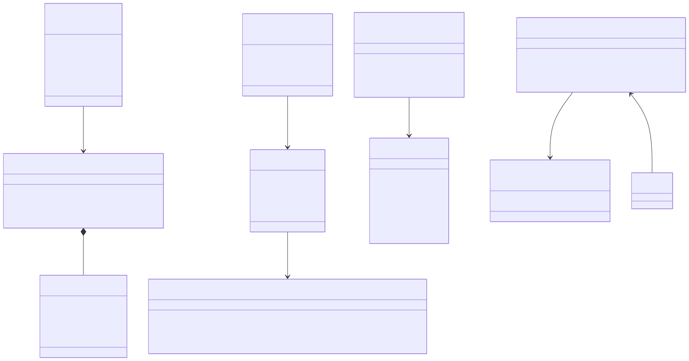

## Data Ingestion And Export Architecture

The current project consumes external data files directly through component constructors and exports simulator telemetry for external review. Additional generic loader classes remain planned.

> Maintainer note: The diagram below is generated from [`data_ingestion.mmd`](data_ingestion.mmd). Edit that file, then run `node docs/sync_diagram.js` to regenerate the SVG.



---

### Implemented Inputs

| Data | File | Consumed By | Purpose |
|------|------|-------------|---------|
| EMRAX 228 map | `src/+lts/+components/+Powertrain/EMRAX228LC Single_3.36.mat` | `lts.components.Powertrain.EMRAX228Powertrain` | Final-drive ratio, motor RPM curve, motor torque, and tractive force |
| Hoosier tire file | `src/+lts/+components/+Tire/43105_18x7.5_10_R25B_7.tir` | `lts.components.Tire.TireConstants` / `PacejkaTire` | Pacejka Magic Formula coefficients and nominal tire properties |
| Test track layouts | `lts.components.TestTrack` methods | `lts.simulation.Simulator` / `lts.driver.DriverModel` | Track points, curvature, heading, and surface friction |
| Real MoTeC lap | `.ld` plus optional `.ldx` | `scripts/extract_motec_lap.py` / `lts.app.run_correlation` | Driver input replay and starting-state extraction for correlation |

### Powertrain Data Behavior

`EMRAX228Powertrain` loads the MAT file and uses:

- `FDR` for total gear ratio.
- `Gearing_Map.RPM` and `Gearing_Map.Traction` for full-throttle drive-force lookup by motor RPM.
- `Speed`, `Torque`, and `Tractive_force` for compatibility torque lookup and wheel-radius inference.
- `rpmFalloffStartRPM` from the last RPM in the map.
- Constant-power torque rolloff (`T ∝ rpmFalloffStartRPM / rpm`) between the map endpoint and `rpmLimitRPM`; `rpmFalloffFactor` is deprecated and ignored.

### Telemetry

The current `stateLog` includes:

- Vehicle channels: time, distance, speed, acceleration, curvature, heading.
- Driver inputs: throttle, brake.
- Aero channels: downforce, drag, front/rear aero loads.
- Suspension channels: corner normal loads, damper position, damper velocity.
- Tire channels: slip ratio, wheel angular velocity, tire longitudinal/lateral force.
- Powertrain channels: drive force, motor RPM, motor torque, wheel torque, driven-wheel RPM, RPM limiter state.

`lts.telemetry.TelemetryExporter.writeToMoTeCFormat(stateLog, filepath)` writes this data to a CSV that follows the [`MotecLogGenerator`](https://github.com/stevendaniluk/MotecLogGenerator) CSV input requirements: the first column is time, remaining rows contain numeric samples, and channel headers include units using `Channel Name (unit)` when a unit is known. For example, motor RPM is written as `Engine RPM (rpm)`. Channels without a known unit are exported without a suffix and remain unitless. The exporter also adds convenience channels such as acceleration in g, fake GPS latitude/longitude in degrees, steering/camber/toe in degrees, damper positions in millimeters, slip ratios in percent, and wheel speeds in rpm.

`lts.telemetry.TelemetryExporter.exportToMoTeCLog(stateLog, filepath)` writes the CSV and then invokes `external/MotecLogGenerator/motec_log_generator.py` to create a `.ld` file. The submodule writes MoTeC-compatible 8-byte display-unit fields and an M1/pro-enabled log header so i2 can use exported channels in math expressions with the correct quantities. `src/+lts/+app/run_simulation.m` enables this by default and writes both `exports/motec_<track>_<config.name>_<timestamp>.csv` and `exports/motec_<track>_<config.name>_<timestamp>.ld`.

Manual conversion is available from MATLAB through `lts.telemetry.TelemetryExporter`:

```matlab
addpath('src')
lts.telemetry.TelemetryExporter.convertCsvToMoTeCLog( ...
    'exports/motec_autocross_20260616_153000.csv', 'Frequency', 1000)
```

The submodule and Python dependencies are required for `.ld` conversion:

```bash
git submodule update --init --recursive
python -m pip install cantools numpy
```

### Correlation Replay

`lts.app.run_correlation` adds the inverse path — real controls drive the
simulator:

1. `scripts/extract_motec_lap.py` reads a real `.ld` file through
   `external/MotecLogGenerator/ldparser`. If a `Lap` is supplied, `ldparser`
   uses BCN markers from the matching `.ldx` sidecar to slice the requested
   1-based public lap; if `Lap` is omitted, the full log is imported (useful for
   autocross and other one-run logs).
2. A channel map (`config/motec/default_channel_map.json`, or
   `config/motec/r25_real_channel_map.json` for R25) maps channel names and
   units to the normalized replay contract: `time_s`, `distance_m`,
   `throttle_ratio`, `brake_ratio`, `brake_pressure_front_bar`,
   `brake_pressure_rear_bar`, `steer_rad`, `speed_mps`, plus optional yaw, GPS,
   course, acceleration, and per-corner wheel-speed channels.
3. `lts.correlation.CorrelationReplayProfile` validates the normalized CSV and
   synthesizes distance from speed when the log has no lap-distance channel.
   `lts.correlation.CorrelationStateInitializer` seeds per-corner tire angular
   velocity from logged wheel speeds when available; missing corners fall back
   to the median of the valid logged wheel speeds at the first sample.
4. `lts.correlation.TelemetryReplayDriver` feeds those measured controls into
   `lts.simulation.Simulator.step` by distance or by time.
5. `lts.telemetry.TelemetryExporter.exportToMoTeCLog` writes the simulated
   replay as a new `.csv` and `.ld` for direct comparison in MoTeC i2.

Replay is free-space input replay: the imported controls and initial state drive
the physics, which produces its own path. There is no GPS/course alignment,
track rebasing, or track-limit stop by default. It defaults to time-domain input
and stops at the imported replay duration rather than the reference track end;
use `ReplayDomain`, `StopAtReplayEnd`, and `StopAtTrackEnd` to override that.

For the channel-map conventions, brake modes (`ratio` / `pressure`), powertrain
modes (`throttle` / `motor_torque_command` / `motor_torque_delivered`),
pack-power limiting, the R25 inverter-channel decoding, steering transfer curve,
and tuning-overlay options, see the **[Correlation Replay](../correlation/)**
page — those details live there so this data-flow page and that reference page
do not diverge.

### Interfaces

| Class | Purpose | Status |
|-------|---------|--------|
| `TrackDataLoader` | Load GPS/cone CSV data, smooth curvature, generate racing line | Planned |
| `lts.telemetry.TelemetryExporter` | Export `stateLog` to MotecLogGenerator CSV and convert to MoTeC `.ld` | Implemented |
| `lts.correlation.CorrelationReplayProfile` | Normalized real-lap replay profile with time/distance sampling | Implemented |
| `lts.correlation.CorrelationTrackAlignment` | Start-station estimation and closed-track rebasing for real-lap replay | Implemented |
| `lts.correlation.TelemetryReplayDriver` | Driver adapter that supplies measured inputs to `lts.simulation.Simulator` | Implemented |
| `lts.correlation.CorrelationAppSupport` | App-level loading, tuning, extraction command, and correlation preflight helpers | Implemented |
| Generic aero map loader | Populate aero lookup tables from CFD data | Planned |
