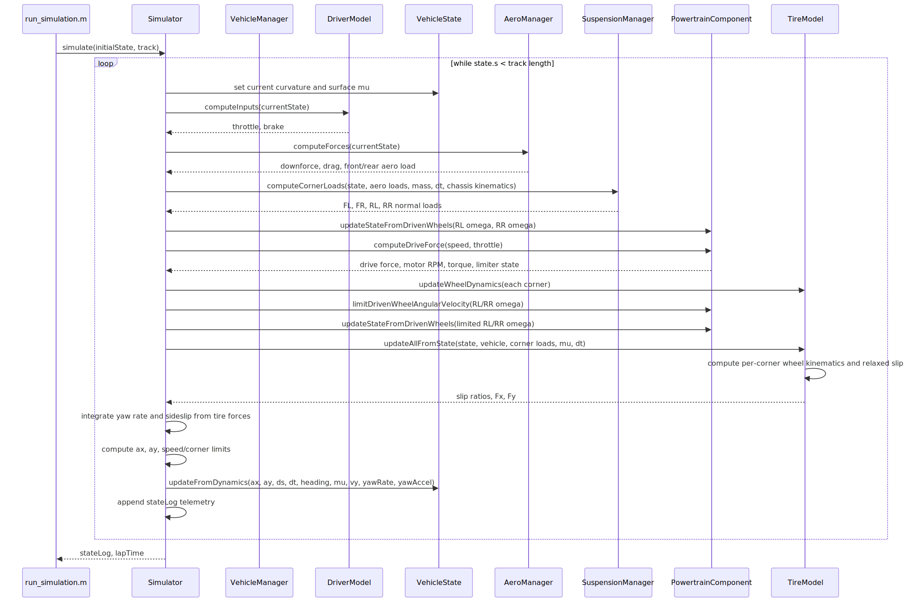

## Simulation Loop Sequence

The following sequence diagram shows how `Simulator.simulate()` advances the vehicle each timestep:

> Maintainer note: The diagram below is generated from [`simulation_loop.mmd`](simulation_loop.mmd). Edit that file, then run `node docs/sync_diagram.js` to regenerate the SVG.

---

### Step-by-step walkthrough

1. **Track lookup** - The simulator finds the current track index and writes curvature and surface friction onto the current `VehicleState`.
2. **Driver input** - `DriverModel` looks ahead along the track and returns throttle and brake.
3. **Aero forces** - `AeroManager` computes front/rear downforce and total drag from the current speed, pitch, and ride height.
4. **Chassis and corner loads** - `SimpleChassis` updates heave, pitch, and roll from force-derived accelerations plus aero pitch moments. `SuspensionManager` converts chassis corner motion into transient tire normal loads.
5. **Powertrain state** - The powertrain updates `PowertrainState.motorRPM` from the driven rear wheel angular velocities.
6. **Drive force** - `PowertrainComponent.computeDriveForce()` returns wheel tractive force. The EMRAX model uses motor RPM, applies torque falloff above the data endpoint, and cuts at the hard RPM cap.
7. **Wheel and tire dynamics** - `PacejkaTire` solves wheel angular velocity, slip ratio, and longitudinal tire force together, using per-corner contact speed for MFeval.
8. **Force balance** - The simulator combines drive, brake, aero drag, rolling resistance, and grip limits to compute longitudinal and lateral acceleration.
9. **State integration** - `VehicleState.updateFromDynamics()` advances speed, distance, acceleration, heading, yaw rate, pitch, and time.
10. **Telemetry** - `stateLog` records vehicle, aero, suspension, tire, and powertrain channels for plotting and debugging.
