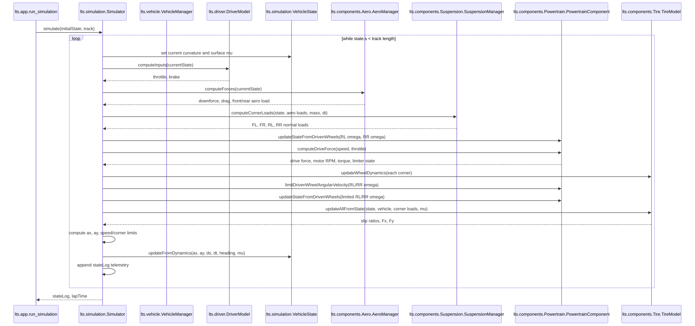

## Simulation Loop Sequence

The following sequence diagram shows how `lts.simulation.Simulator.simulate()` advances the vehicle each timestep:

> Maintainer note: The diagram below is generated from [`simulation_loop.mmd`](simulation_loop.mmd). Edit that file, then run `node docs/sync_diagram.js` to regenerate the SVG.

---

### Step-by-step walkthrough

1. **Reference lookup** - The simulator projects the current free-space `x, y` position onto the track reference and writes curvature, heading, surface friction, lateral error, and on-track status onto `lts.simulation.VehicleState`.
2. **Driver input** - `lts.driver.DriverModel` samples its planned profile, adds path corrections, and returns throttle, brake, and steer. Replay mode uses `lts.correlation.TelemetryReplayDriver` instead.
3. **Aero forces** - `AeroManager` computes front/rear downforce and total drag from the current speed, pitch, and ride height.
4. **Corner loads** - With a chassis attached, `SuspensionManager` converts the chassis attitude from the previous completed step into transient tire normal loads. Without a chassis, it falls back to algebraic load transfer.
5. **Powertrain and brakes** - The powertrain updates `PowertrainState.motorRPM` from the driven rear wheel angular velocities, computes rear-axle wheel torque, and the differential splits it. Brake command or logged brake pressure is converted into per-wheel brake torque.
6. **Wheel and tire dynamics** - `PacejkaTire` and the simulator's wheel-contact loop solve wheel angular velocity, slip ratio, slip angle, and Magic Formula tire forces, using per-corner contact speed for MFeval.
7. **Force balance** - The simulator sums tire forces and yaw moments, subtracts aero drag along the velocity vector, and computes body accelerations and yaw acceleration.
8. **State integration** - `lts.simulation.VehicleState.updateFromPlanarDynamics()` commits the free planar state: `vx`, `vy`, `x`, `y`, `yaw`, `yawRate`, reference progress, lateral error, and derived attitude telemetry.
9. **Chassis attitude** - `SimpleChassis` updates heave, pitch, front/rear roll, and twist from the just-computed accelerations and aero pitch moments. That attitude feeds the next step's corner loads and aero platform.
10. **Telemetry** - `stateLog` records vehicle, aero, suspension, tire, and powertrain channels for plotting, MoTeC export, and debugging.

For the equations behind these steps, see the [Physics Flow](/lts/physics-flow/) page.
