## Department Workflow

The following diagram shows how subsystem data is assembled into a simulation and reviewed through telemetry:

> Maintainer note: The diagram below is generated from [`workflow.mmd`](workflow.mmd). Edit that file, then run `node docs/sync_diagram.js` to regenerate the SVG.

---

### How it works

1. **Aero** - Component coefficients and positions are implemented as `FrontWing`, `RearWing`, `UnderbodyFloor`, or other `AeroComponent` subclasses. `AeroManager` resolves their forces and aero balance.
2. **Suspension** - Spring, damper, bump stop, tire stiffness, roll stiffness split, and vehicle geometry are assembled by `SuspensionManager`, with one `SuspensionState` per corner.
3. **Powertrain** - The current EMRAX 228 model loads `EMRAX228CC Single_4.5.mat`, tracks motor RPM from driven wheel speed, applies torque falloff, and logs motor/wheel torque.
4. **Tires** - `PacejkaTire` loads the provided `.tir` file and manages four `TireState` objects for slip, wheel speed, and force telemetry.
5. **Track** - `TestTrack` supplies built-in layouts and curvature/surface-friction arrays.
6. **Simulation** - `Simulator` combines the selected components with `DriverModel` and returns `stateLog` plus `lapTime`.
7. **Review** - `GraphPlotter` dashboards expose speed, acceleration, aero forces, normal loads, damper travel, tire slip/forces, drive force, motor RPM, and RPM limiter state.
